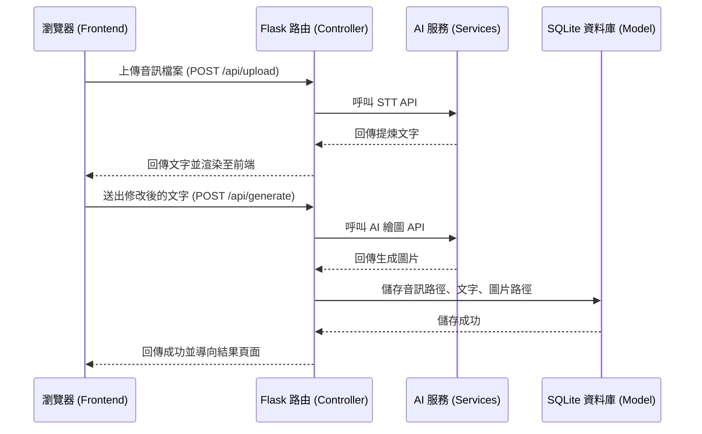

# 系統架構設計 (ARCHITECTURE) - 感官封存模組

## 1. 技術架構說明
本專案採用典型的 Web 應用程式架構，以 Python Flask 作為後端框架，不採用純前後端分離，而是透過 Flask 與 Jinja2 直接渲染頁面，以降低開發複雜度並加快 MVP 實作速度。

- **前端 (Frontend)**：HTML / CSS / Vanilla JS
  - 負責使用者介面互動，包含使用 Web Audio API 進行錄音，以及向後端發送包含音訊或文字的 API 請求，並顯示 Loading 動態與最終封存結果。
- **後端 (Backend)**：Python + Flask
  - 負責接收前端請求、處理檔案上傳、串接外部 AI 服務（語音轉文字、AI 繪圖），並將資料寫入資料庫。
- **模板引擎 (Template Engine)**：Jinja2
  - 結合後端傳遞的資料，動態生成 HTML 頁面並回傳給瀏覽器。
- **資料庫 (Database)**：SQLite
  - 輕量級關聯式資料庫，適合初期 MVP 開發。儲存感官紀錄（如音訊檔路徑、提煉文字、圖片路徑與時間戳記）。

**MVC 模式職責分配**：
- **Model (模型)**：管理資料庫的結構與 CRUD 操作。
- **View (視圖)**：Jinja2 模板與靜態資源（CSS/JS），負責將資料呈現給使用者。
- **Controller (控制器)**：Flask 路由，負責接收 HTTP 請求、呼叫模型進行資料處理、呼叫外部 API，最後決定渲染哪一個視圖並回傳。

## 2. 專案資料夾結構

建議的資料夾結構如下，以模組化方式組織程式碼：

```text
time5.demo/
│
├── app/
│   ├── __init__.py          # 建立 Flask App 實例與初始化
│   ├── models/              # 資料庫模型與存取邏輯
│   │   ├── __init__.py
│   │   └── record.py        # 處理封存紀錄的資料庫操作
│   ├── routes/              # Flask 路由 (Controller)
│   │   ├── __init__.py
│   │   ├── main.py          # 主頁面路由 (首頁、歷史紀錄)
│   │   └── api.py           # 負責處理非同步請求與呼叫 AI API
│   ├── services/            # 外部服務串接邏輯
│   │   ├── stt_service.py   # 語音轉文字 API 串接
│   │   └── image_service.py # AI 繪圖 API 串接
│   ├── templates/           # Jinja2 HTML 模板 (View)
│   │   ├── base.html        # 共用版型
│   │   ├── index.html       # 首頁 (錄音/上傳介面)
│   │   ├── result.html      # 編輯文字與生成圖片頁面
│   │   └── history.html     # 歷史封存紀錄列表頁面
│   └── static/              # 靜態資源
│       ├── css/
│       │   └── style.css    # 全域樣式表
│       ├── js/
│       │   └── main.js      # 處理 Web Audio API 錄音與上傳等邏輯
│       └── uploads/         # 使用者上傳與生成的檔案 (音檔、圖片)
│
├── instance/
│   └── database.db          # SQLite 資料庫檔案
│
├── docs/                    # 專案文件
│   ├── PRD.md               # 產品需求文件
│   └── ARCHITECTURE.md      # 系統架構文件
│
├── requirements.txt         # Python 相依套件清單
├── .env                     # 環境變數 (API Keys等，不進版控)
└── run.py                   # 啟動應用程式的進入點
```

## 3. 元件關係圖

以下是整個系統從瀏覽器到後端與外部 API 的運作流程：



## 4. 關鍵設計決策

1. **Services 層的分離**：將呼叫外部 AI API (STT、AI 繪圖) 的邏輯從 `routes` 獨立出來放進 `services` 資料夾。這使得程式碼更易於維護，且未來若要更換不同的 API 供應商（如從 Whisper 換成 Google STT），只需修改 service 層的程式，而不用動到主要的控制邏輯。
2. **靜態檔案存於本地 `static/uploads/`**：考量到 MVP 階段快速開發的需求，使用者的音檔與生成的圖片將直接存放在專案資料夾內。但後續若要部署上線，建議將這部分改為雲端儲存（如 AWS S3），以避免伺服器硬碟空間不足。
3. **前端非同步處理**：由於呼叫 AI 服務（特別是繪圖）需要較長時間，在 `index.html` 送出音訊或文字時，透過 JavaScript 使用 AJAX / Fetch API 非同步發送請求，以便在畫面上顯示明確的 Loading 狀態，而不會讓畫面卡死。
