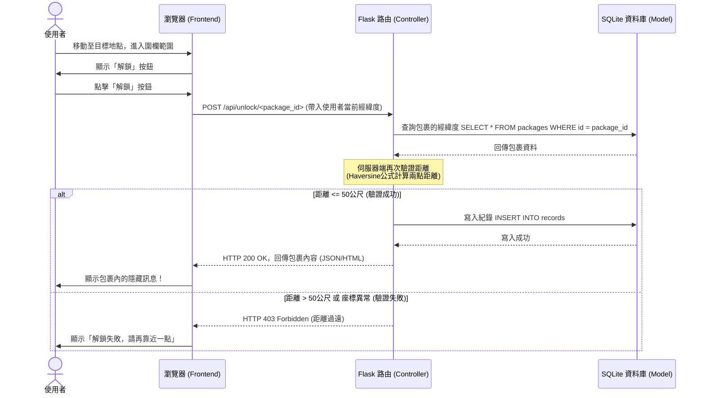

# GeoDrop 流程圖設計 (Flowchart)

## 1. 使用者流程圖（User Flow）

以下流程圖說明使用者進入網站後，如何尋找、解鎖包裹，以及如何創建新的包裹：

```mermaid
flowchart LR
    Start([使用者進入首頁]) --> Map[主畫面：顯示目前位置與地圖]
    
    Map --> Decision{要進行什麼操作？}
    
    Decision -->|尋找包裹| ViewMap[查看附近未解鎖的包裹]
    ViewMap --> Move[移動至包裹位置 (GPS 更新)]
    Move --> InRange{距離 < 50 公尺？}
    InRange -->|否| Wait[顯示距離與鎖定狀態]
    Wait --> Move
    InRange -->|是| UnlockBtn[顯示「解鎖」按鈕]
    UnlockBtn --> ClickUnlock([點擊解鎖])
    ClickUnlock --> ShowContent[顯示包裹內隱藏訊息]
    ShowContent --> Map
    
    Decision -->|新增包裹| CreateBtn[點擊「創建包裹」]
    CreateBtn --> FillForm[填寫訊息內容與選擇目前位置]
    FillForm --> Submit([送出表單])
    Submit --> Map
    
    Decision -->|查看紀錄| ProfileBtn[點擊「我的紀錄」]
    ProfileBtn --> History[顯示已解鎖的歷史包裹列表]
    History --> Map
```

---

## 2. 系統序列圖（Sequence Diagram）

以下序列圖描述「使用者到達目標地點並點擊解鎖」到「系統將解鎖紀錄存入資料庫並回傳內容」的完整流程：



---

## 3. 功能清單對照表

以下為 GeoDrop 系統的功能與對應的路由規劃：

| 功能名稱 | 對應 URL 路徑 | HTTP 方法 | 說明 |
| :--- | :--- | :--- | :--- |
| **首頁與地圖主畫面** | `/` | GET | 載入地圖介面、前端 JS 與基礎版型。 |
| **取得附近包裹 (API)** | `/api/packages` | GET | 根據前端傳入的座標，回傳附近的包裹標記資訊。 |
| **解鎖包裹 (API)** | `/api/unlock/<int:package_id>` | POST | 前端傳送經緯度，後端驗證距離並回傳包裹內容與結果。 |
| **新增包裹頁面** | `/package/new` | GET | 顯示填寫新包裹訊息的表單介面。 |
| **送出新增包裹** | `/package/new` | POST | 接收表單資料，將新包裹存入資料庫。 |
| **個人歷史紀錄** | `/profile` | GET | 查詢該使用者成功解鎖過的所有紀錄並渲染列表。 |
